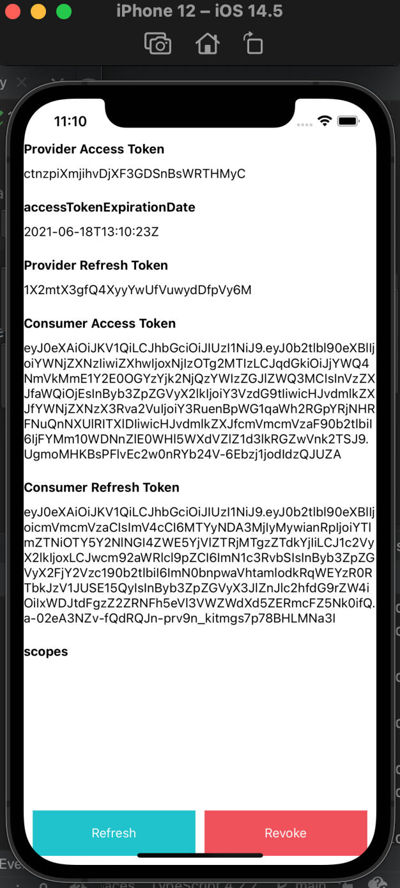

# OAuth Provider and Client: Two-Sided Implementation of OAuth + OpenID Connect

Implementing a provider that becomes a social provider
(i.e. the Velnota in "Signup with Velnota"),
and a consumer that allows its users/clients to register using
said provider.

This is mostly for learning but also **I can replicate
this process really fast. No Googling necessary**. All code
is just provided here.

---
## Tutorial

The follow tutorial is split in two sections.
By default, all instructions are opened, but you
can collapse them by pressing on that arrow next
to the titles if it's just too much.

The purpose is to be as quick as possible in this tutorial with
all resources needed without a single Google search necessary.

### Pre-requisites

TL;DR just read the [requirements file](./requirements.txt).
We're using Django 3.2 right now.

<details>
<summary>More info</summary>
Your server needs django-oauth-toolkit and django-cors-headers.
Your "client" needs django-allauth (recommended since they have a base
class. Also, I've been using cookiecutter-django like a drug
addict, so no surprises here).

Besides requirements, you'll also probably want a website already working
ish. For example, a registration page would be helpful for server.
</details>

### Instructions

The following is happening in the [provider](./provider) folder.
You can use it as reference in case you get stuck or want
to double-check something.

We assume that `provider` is a website, and not just some random
REST API. It must have a proper website to login from.
NGL though, you can also start from scratch, and there's still resources
in Notes sections to get you up to speed in total 30 minutes TOPS (it's a lot).

For more details or if you think this is out of date, head to their
[docs](https://django-oauth-toolkit.readthedocs.io/en/latest/tutorial/tutorial_01.html).

Table of Contents
- Provider instructions
- Web Consumer instructions
- Mobile and/or Web (optional) Consumer instructions

<details open>
<summary><strong>Provider instructions</strong></summary>

1. Follow the installation instructions at
   [django-oauth-toolkit's docs](https://django-oauth-toolkit.readthedocs.io/en/latest/install.html)
1. Add `oauth2_provider` and `corsheaders` to `INSTALLED_APPS`
1. Add this to `urls.py`: `path("o/", include('oauth2_provider.urls', namespace='oauth2_provider')),`
1. Add `corsheaders` to `MIDDLEWARE`: `'corsheaders.middleware.CorsMiddleware',`.
   Please read Note 1 below for placement.
1. In your settings, add: `"REQUEST_APPROVAL_PROMPT": "auto"` in the
   `OAUTH2_PROVIDER` dictionary in your settings file. The `REQUEST_APPROVAL_PROMPT`
   being set to `auto` means that a user that already signed up doesn't need to
   authorize the consumer (via a button click) for the rest of the user's login
   sessions. Add `CORS_URLS_REGEX = r"^/o/.+$"`.
   In regex, this means you allow any url to be accessed from any origin whose url path
   MUST START with `/o/` and must have more characters
   following that `/o/` prefix (i.e. there must be more to the path to be valid).
1. Add this to your login form: `<input type="hidden" name="next" value="{{ next }}" />`.
   It is required that `provider` is a website that has a user-faced login form.
   If you are just starting out, read Note 3.
1. `python manage.py migrate && python manage.py createsuperuser`
1. Start the server with a different port like: `python manage.py runserver 8001`
1. Follow the [OpenID Connect tutorial](https://django-oauth-toolkit.readthedocs.io/en/latest/oidc.html).
   Use the RSA algorithm. Use OpenID Connect Authorization flow. Please don't use
   Implicit flow for both OAuth (deprecated too) and OIDC.
   Just note that for an SPA if you're starting from scratch might want to use
   Authorization flow with public claim.
   [Ref](https://medium.com/@robert.broeckelmann/securely-using-the-oidc-authorization-code-flow-and-a-public-client-with-single-page-applications-55e0a648ab3a)
1. Head to: http://localhost:8001/o/applications/ and login.
1. For the next few instructions, refer to the Part 1 of the tutorial.
   Link to helpful tool to
   [choose resources](https://medium.com/@robert.broeckelmann/when-to-use-which-oauth2-grants-and-oidc-flows-ec6a5c00d864).
   Refer to Notes 4+ if you need to make a decision (specifically made for social provider).
   Those notes make the decision for you so you can speed up the process. Just know for
   this tutorial, redirect URI is http://localhost:8000/accounts/custom/login/callback/
   For now, only complete Part 1 of the tutorial (the rest you can understand alone):
   https://django-oauth-toolkit.readthedocs.io/en/stable/tutorial/tutorial_01.html#create-an-oauth2-client-application

**IT IS EXTREMELY IMPORTANT you use 127.0.0.1:8001 throughout this tutorial**.
You must use the same exact domain the entire time. The domains for
provider and consumer CANNOT be the same otherwise the session cookies
will be mixed up.

<details>
<summary>Notes for Server Instructions</summary>

1. CorsMiddleware should be placed as high as possible, especially before any
   middleware that can generate responses such as Django’s CommonMiddleware or
   Whitenoise’s WhiteNoiseMiddleware. If it is not before, it will not be able to
   add the CORS headers to these responses. For example:
   ```python
   MIDDLEWARE = [
       'django.middleware.security.SecurityMiddleware',
       'corsheaders.middleware.CorsMiddleware',
       'django.contrib.sessions.middleware.SessionMiddleware',
        ...]
   ```
1. Why did I basically write the exact same instructions as the tutorial?
   Well they wanted to use django-cors-middleware and not django-cors-headers.
   Things go unmaintained all the time, but the middleware version is just
   shut down completely, and the django-oauth-toolkit docs aren't up to date
   with that info.
1. You can also just do the following (credit goes to
   [SIBTC](https://simpleisbetterthancomplex.com/tutorial/2016/06/27/how-to-use-djangos-built-in-login-system.html)):
   1. Go to urls.py and add:
   ```python
   from django.urls import path
   from django.contrib.auth.views import LoginView, LogoutView
   urlpatterns = [
    ...,
    path("accounts/login/", LoginView.as_view(), name='login'),
    path("accounts/logout/", LogoutView.as_view(), name='logout'),
    ...
   ]
   ```
   1. The following three steps is if you just don't have login
      setup yet. Add this homepage to `urls.py`:
      ```python
      from django.urls import path
      from django.views.generic import TemplateView
      urlpatterns = [
        ...,
        path("",
            TemplateView.as_view(template_name="base.html"),
            name="home"
        ),
        ...,
      ]
      ```
   1. Add `LOGIN_REDIRECT_URL = 'home'` to your settings.
   1. Create a template folder and add that to `TEMPLATES` variable
      in settings. Then create `base.html` in that template dir. It
      can be as simple as:
      ```html
      <!DOCTYPE html>
      <html lang="en">
      <head>
          <meta charset="UTF-8">
          <title>Title</title>
      </head>
      <body>
      
      </body>
      </html>
      ```
   1. Then create a template at `registration/login.html`:
   ```html
   <!-- If you don't have base.html, then
   you can make a random <body></body> tag instead
   and stick a random thing in. Remember to go to
   settings.py and add your templates dir to `TEMPLATES`
   -->
   
   Login
   
   <h2>Login</h2>
   <form method="post">
     
     {{ form.as_p }}
     <input type="hidden" name="next" value="{{ next }}" />
     <button type="submit">Login</button>
   </form>
   
   ```
1. The following is for social provider specific decisions.
   For "Create an OAuth 2 Client Application", save the client id and secret.
   Select "Public" client type (Confidential is for CLIs). "Authorization code" for
   authorization grant type. For redirect URI if you're using allauth from
   the next tutorial below: http://localhost:8000/accounts/custom/login/callback/
   Algorithm is RSA SHA-2 256. When developing with the consumer on port 8000,
   make sure you stay on localhost. Anytime you mention anything with port 8001,
   in this case the provider, make sure you are on 127.0.0.1 or basically a completely
   different domain/host.
1. The redirect uri should have the domain be the same as the way you're accessing
   the consumer. So if you're logging in from http://localhost:8000, then your
   redirect uri must also use localhost:8000

</details>
<!-- End of provider instructions -->
</details>

<details open>
<summary><strong>Web Consumer instructions</strong></summary>

1. Let's create a consumer using provider compatible workflows from django-allauth.
   I'm assuming you've already got a Django project set up; I'm basing this off
   [allauth's Google implementation](https://github.com/pennersr/django-allauth/blob/80e07a25803baea4e603251254c7d07ef2ad5bb5/allauth/socialaccount/providers/google/provider.py).
   Visit the following files in the consumer folder:
   [consumer/public/urls.py (visit Note 2 for explanation)](./consumer/public/urls.py),
   [consumer/public/views.py (visit Note 3 for explanation)](./consumer/public/views.py),
   [consumer/public/provider.py (visit Note 4 for explanation)](./consumer/public/provider.py),
   [consumer/public/migrations/0001_initial.py (visit Note 5 for explanation)](./consumer/public/migrations/0001_initial.py),
   [consumer/consumer/urls.py (visit Note 6 for explanation)](./consumer/consumer/urls.py),
   and finally the upper portion of settings:
   [consumer/consumer/settings.py (notes in the file itself)](./consumer/consumer/settings.py).
1. Make sure your provider lives in a file called `provider.py` or else django-allauth
   can't find your provider. Also make sure that `provider.py` is in an app
   that is in the `INSTALLED_APPS` list.
1. Finally, run both servers. The consumer should be using
   `python manage.py runserver` and the provider/server should be using
   `python manage.py runserver 8001`.
1. Go to your consumer login url: http://localhost:8000/accounts/login/.
   You should see the `sign in below: custom` where `custom` was the provider
   name I chose.

<details>
<summary>Notes</summary>

1. The redirect uri should have the domain be the same as the way you're accessing
   the consumer. So if you're logging in from http://localhost:8000, then your
   redirect uri must also use localhost:8000
1. The [consumer/public/urls.py](./consumer/public/urls.py) implementation is just
   to add the django-allauth provider urls. These URLs are the basis for how we grab
   the tokens and register our user.
1. The [consumer/public/views.py](./consumer/public/views.py) implementation is a
   django-allauth subclassed view that complete a social authentication workflow
1. The [consumer/public/provider.py](./consumer/public/provider.py) file is a
   django-allauth provider that configures a new user and authenticates the user based
   on the scopes given in the provider's given token.
1. [consumer/public/migrations/0001_initial.py](./consumer/public/migrations/0001_initial.py)
   is meant for django-allauth. The package requires we have a site in the Django
   provided `Site` model. The code is from cookiecutter-django; I made this migration
   specifically so that we didn't need to create a new Site ourselves via a database CLI.
1. The [consumer/consumer/urls.py](./consumer/consumer/urls.py) is meant to add our
   `public` app's urls (which included the provider url). Additionally, you may notice
   a `TemplateView` being used. In the sample code, I added an index/landing page for
   debugging purposes to show whether the current user is authenticated or not.
1. For those wondering why they're going to `/accounts/profile` on login:
   https://django-allauth.readthedocs.io/en/latest/faq.html#when-i-attempt-to-login-i-run-into-a-404-on-accounts-profile

</details>
<!-- End of web consumer instructions -->
</details>

<details open>
<summary><strong>
Mobile and/or Web (optional) Consumer instructions
</strong></summary>

<details><summary>Explanation</summary>

Before we begin, I want to clarify how this works from the mobile perspective.
We will still be using django-allauth, but for authentication purposes,
we will be using `djangorestframework-simplejwt`. It's an alternative to
Django's session authentication by using stateless JWT tokens. You can also
set up `django-oauth-toolkit` for your consumer instead of `simplejwt` (they're
the exact same thing except OAuth gives "scopes" permissions out-of-the-box).

Additionally, if you'd like to see an example code that hosts the mobile app,
visit https://github.com/Andrew-Chen-Wang/react-native-oauth-login for a fuller
explanation with a for using React Native.

Anyways, the explanation: imagine you're on an app. You press a button that says
"Sign In with Velnota" (no register button since `django-allauth` auto registers
on first login; this can be changed with `SOCIALACCOUNT_AUTO_SIGNUP=False` in
your settings). This button is actually a URL that takes you to the provider's
login page directly without passing the consumer. We want the client to get their
access and refresh token pair directly from the provider.

Then the client gives those provider tokens to the mobile consumer. The consumer
creates its own tokens for the client to use against their endpoints. In this
exchange, the provider tokens will be encrypted in the consumer tokens for
use by the consumer whenever they want. If the user has never signed up on
the consumer end before, using `django-allauth`,
auto signup is enabled (sort of as we still need to write some more code).

We do this because the tokens given by the provider is for authorization against
the **provider's** endpoints, not the consumers (having trouble? Imagine you have a
project but don't want to send emails. Provider is Google, so we use Google to
authenticate. We have several endpoints for our app to use; those endpoints are OURS.
Thus, we are coding this on our project, that is the consumer, and not on the provider,
which is Google in this case).

So the tokens we receive on the mobile app is for going to the endpoints
on the consumer, and the first request is for going to authorized-endpoints
on the provider.

</details>

The Tutorial:

1. Let's create a consumer using provider compatible workflows from django-allauth.
   I'm assuming you've already got a Django project set up; I'm basing this off
   [allauth's Google implementation](https://github.com/pennersr/django-allauth/blob/80e07a25803baea4e603251254c7d07ef2ad5bb5/allauth/socialaccount/providers/google/provider.py).
   Visit the following files in the `mobile_consumer` folder:
   [mobile_consumer/public/urls.py](./mobile_consumer/public/urls.py),
   [mobile_consumer/public/views.py](./mobile_consumer/public/views.py),
   [mobile_consumer/public/provider.py](./mobile_consumer/public/provider.py),
   [mobile_consumer/public/migrations/0001_initial.py](./mobile_consumer/public/migrations/0001_initial.py),
   [mobile_consumer/mobile_consumer/urls.py](./mobile_consumer/mobile_consumer/urls.py),
   and finally the upper portion of settings:
   [mobile_consumer/mobile_consumer/settings.py](./mobile_consumer/mobile_consumer/settings.py).
1. Register for your application, but, this time, the redirect uri can't be some
   regular http request. It's going to be a custom scheme that apps use.
   If you read up on AppAuth repositories or my
   [React Native implementation](https://github.com/Andrew-Chen-Wang/react-native-oauth-login)
   repository, this is meant for the redirect uri, for example:
   `com.oauthlogin.auth://custom/login/callback`
1. If you're continuing from the web portion, you may be wondering what changed?
   [views.py](./mobile_consumer/public/views.py) is completely different as we
   implement our own view for a "callback" mechanism (specifically, it handles
   saving the tokens and registering the user and what not).
1. In the provider settings (i.e.
   [provider/server/settings.py](provider/server/settings.py)), we add a new field
   to the `OAUTH2_PROVIDER` settings:
   `"ALLOWED_REDIRECT_URI_SCHEMES": ["http", "https", "com.oauthlogin.auth"],`
   The last value is the scheme from Step 2.

Finally, you'll end up with something like this:



<details><summary>Notes</summary>

1. You may be wondering: why set the SimpleJWT and provider's tokens to never
   expire? Credentials. Unlike before, the mobile app can't save any username
   or password for BOTH the provider (i.e., we can't see the username and password for
   the provider) and the consumer (i.e., the consumer does not use
   credentials in the first place with the consumer; otherwise, that'd be security
   risk on the provider end if the provider wanted the user/client to save their
   provider credentials on a supposedly random consumer, generally speaking).

</details>
<!-- End of mobile consumer instructions -->
</details>

---
### FAQ

If you don't need regular signup, create a default account adapter
in Allauth and set the `is_open_for_signup` method to return False.

### Extra Notes

The provider is the one where the user initially signs up.
The consumer is the one where the user signs up on a different
website but uses the initial website's "account" to authenticate
on the second site.

---
### Credit and License

By: Andrew Chen Wang

Thanks django-allauth and django-oauth-toolkit for just being
awesome packages. Love 'em.

Project licensed under Apache 2.0. The full license file can
be found in [LICENSE](./LICENSE)

```text
Copyright 2021 Andrew Chen Wang

Licensed under the Apache License, Version 2.0 (the "License");
you may not use this file except in compliance with the License.
You may obtain a copy of the License at

   https://www.apache.org/licenses/LICENSE-2.0

Unless required by applicable law or agreed to in writing, software
distributed under the License is distributed on an "AS IS" BASIS,
WITHOUT WARRANTIES OR CONDITIONS OF ANY KIND, either express or implied.
See the License for the specific language governing permissions and
limitations under the License.
```
